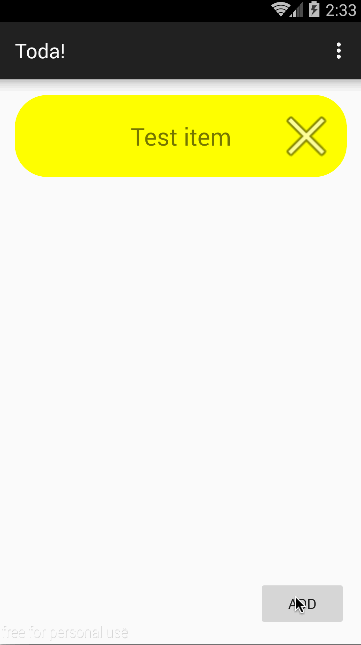

# Todo Codepath pre-work

This is an Android app that implements a persistent, editable todo list. 

Time spent: 2 hours spent in total

Completed user stories:

 * [x] Required: User can add and delete todo items
 * [x] Required: Todo list is persisted across application restart
 * [x] Required: User can start a second activity to edit list items
 
Walkthrough of all user stories:

GIF created with [LiceCap](http://www.cockos.com/licecap/).

